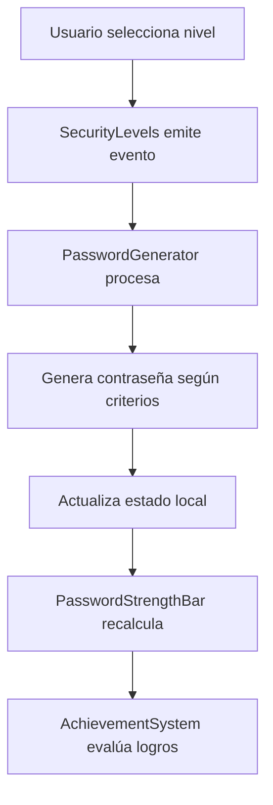
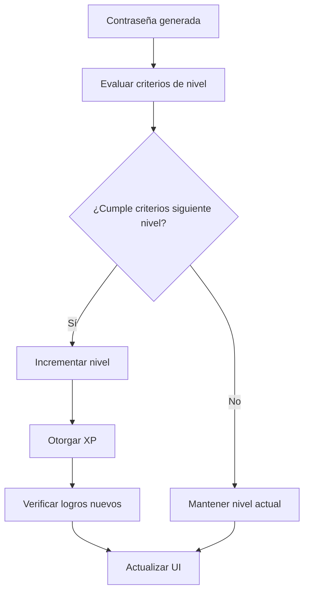

# 🏗️ Arquitectura del Proyecto

Este documento describe la arquitectura del Generador de Contraseñas Interactivo y cómo los componentes interactúan entre sí.

## 📊 Visión General

La aplicación sigue una arquitectura de componentes React moderna con estado local y props drilling mínimo. Está diseñada para ser mantenible, escalable y fácil de entender.

```
┌─────────────────────────────────────────┐
│              App.tsx                    │
│  (Router, Providers, Global Config)     │
└─────────────────┬───────────────────────┘
                  │
┌─────────────────▼───────────────────────┐
│            Index.tsx                    │
│         (Página Principal)              │
└─────────────────┬───────────────────────┘
                  │
┌─────────────────▼───────────────────────┐
│        PasswordGenerator.tsx            │
│      (Componente Orquestador)           │
└─────┬───────┬───────┬──────────┬────────┘
      │       │       │          │
      ▼       ▼       ▼          ▼
┌─────────┐ ┌─────┐ ┌─────────┐ ┌─────────┐
│Security │ │Tips │ │Strength │ │Achieve  │
│Levels   │ │     │ │Bar      │ │System   │
└─────────┘ └─────┘ └─────────┘ └─────────┘
```

## 🧩 Componentes Principales

### PasswordGenerator.tsx
**Responsabilidad**: Componente orquestador principal
- Maneja el estado global de la aplicación
- Coordina la comunicación entre componentes
- Gestiona la lógica de generación de contraseñas
- Controla el sistema de niveles y progresión

```typescript
// Estado principal
const [currentLevel, setCurrentLevel] = useState(1);
const [userXP, setUserXP] = useState(0);
const [generatedPassword, setGeneratedPassword] = useState('');
const [achievements, setAchievements] = useState<Achievement[]>([]);
```

### SecurityLevels.tsx
**Responsabilidad**: Sistema de progresión gamificado
- Renderiza las tarjetas de niveles de seguridad
- Maneja la lógica de desbloqueado de niveles
- Proporciona feedback visual del progreso
- Gestiona la generación de contraseñas por nivel

**Props Interface**:
```typescript
interface SecurityLevelsProps {
  currentLevel: number;
  onGeneratePassword: (level: number) => void;
}
```

### PasswordStrengthBar.tsx
**Responsabilidad**: Visualización de seguridad
- Calcula y muestra la fuerza de la contraseña
- Proporciona feedback visual inmediato
- Anima las transiciones de nivel de seguridad
- Muestra criterios de seguridad específicos

### AchievementSystem.tsx
**Responsabilidad**: Sistema de logros y gamificación
- Gestiona logros desbloqueados
- Muestra progreso de XP
- Renderiza notificaciones de logros
- Maneja la persistencia de datos (localStorage)

### PasswordTips.tsx
**Responsabilidad**: Educación y consejos
- Proporciona tips contextuales de seguridad
- Muestra buenas prácticas
- Explica conceptos de ciberseguridad
- Adapta contenido según el nivel actual

## 🔄 Flujo de Datos

### 1. Generación de Contraseña


### 2. Sistema de Progresión


## 🏪 Gestión de Estado

### Estado Local por Componente

#### PasswordGenerator (Estado Principal)
```typescript
// Estado de progresión del usuario
const [currentLevel, setCurrentLevel] = useState(1);
const [userXP, setUserXP] = useState(0);
const [totalPasswordsGenerated, setTotalPasswordsGenerated] = useState(0);

// Estado de la contraseña actual
const [generatedPassword, setGeneratedPassword] = useState('');
const [passwordStrength, setPasswordStrength] = useState(0);

// Estado de logros
const [achievements, setAchievements] = useState<Achievement[]>([]);
const [unlockedAchievements, setUnlockedAchievements] = useState<string[]>([]);
```

#### SecurityLevels (Estado de UI)
```typescript
// Control de animaciones y efectos visuales
const [animatingLevel, setAnimatingLevel] = useState<number | null>(null);
const [showLevelUp, setShowLevelUp] = useState(false);
```

### Persistencia de Datos
Los datos se persisten en `localStorage` para mantener el progreso del usuario:

```typescript
// Estructura de datos persistidos
interface UserProgress {
  currentLevel: number;
  userXP: number;
  totalPasswordsGenerated: number;
  unlockedAchievements: string[];
  lastVisit: string;
}
```

## 🎨 Sistema de Temas y Estilos

### Paleta de Colores
```css
/* Gradientes principales */
--gradient-primary: from-blue-600 via-purple-600 to-cyan-500
--gradient-secondary: from-green-500 to-emerald-500
--gradient-warning: from-yellow-500 to-orange-500
--gradient-danger: from-red-500 to-pink-500

/* Niveles de seguridad */
--level-1: from-red-500 to-pink-500      /* Principiante */
--level-2: from-yellow-500 to-orange-500  /* Guerrero */
--level-3: from-green-500 to-emerald-500  /* Guardián */
--level-4: from-purple-500 via-blue-500 to-cyan-500  /* Maestro */
```

### Sistema de Animaciones
- **Hover Effects**: `hover:scale-105 transition-all duration-300`
- **Loading States**: `animate-pulse`, `animate-bounce`
- **Level Transitions**: Custom keyframes para efectos de subida de nivel
- **Achievement Unlocks**: Animaciones de celebración

## 🔧 Algoritmos de Generación

### Generación de Contraseñas por Nivel

```typescript
const generatePasswordByLevel = (level: number): string => {
  const configs = {
    1: { length: 8, charset: 'abcdefghijklmnopqrstuvwxyz' },
    2: { length: 10, charset: 'abcdefghijklmnopqrstuvwxyzABCDEFGHIJKLMNOPQRSTUVWXYZ0123456789' },
    3: { length: 12, charset: 'abcdefghijklmnopqrstuvwxyzABCDEFGHIJKLMNOPQRSTUVWXYZ0123456789!@#$%^&*' },
    4: { length: 16, charset: 'abcdefghijklmnopqrstuvwxyzABCDEFGHIJKLMNOPQRSTUVWXYZ0123456789!@#$%^&*()_+-=[]{}|;:,.<>?' }
  };
  
  // Implementación usando Math.random() para seguridad adecuada
};
```

### Cálculo de Fuerza de Contraseña

```typescript
const calculatePasswordStrength = (password: string): number => {
  let score = 0;
  
  // Criterios de evaluación
  if (password.length >= 8) score += 25;
  if (/[a-z]/.test(password)) score += 25;
  if (/[A-Z]/.test(password)) score += 25;
  if (/\d/.test(password)) score += 25;
  if (/[^A-Za-z0-9]/.test(password)) score += 25;
  
  return Math.min(score, 100);
};
```

## 🚀 Extensibilidad

### Añadir Nuevos Niveles
1. Actualizar el array `levels` en `SecurityLevels.tsx`
2. Modificar el algoritmo de generación
3. Añadir nuevos iconos y colores
4. Actualizar el sistema de logros

### Nuevos Tipos de Logros
```typescript
interface Achievement {
  id: string;
  name: string;
  description: string;
  icon: string;
  type: 'level' | 'generation' | 'streak' | 'special';
  criteria: (userStats: UserStats) => boolean;
  reward: {
    xp: number;
    badge?: string;
  };
}
```

### Integración con Backend
La arquitectura está preparada para integrar con Supabase:
- Reemplazar `localStorage` con llamadas a API
- Añadir autenticación de usuarios
- Implementar sistema de ranking global
- Sincronización cross-device

## 📱 Responsive Design

### Breakpoints
- **Mobile**: `< 768px` - Layout vertical, componentes apilados
- **Tablet**: `768px - 1024px` - Grid de 2 columnas
- **Desktop**: `> 1024px` - Grid completo de 4 columnas

### Componentes Adaptativos
```typescript
// Ejemplo de componente responsive
const SecurityLevels = () => {
  return (
    <div className="grid grid-cols-1 md:grid-cols-2 lg:grid-cols-4 gap-4">
      {/* Componentes se adaptan automáticamente */}
    </div>
  );
};
```

## 🔍 Performance y Optimización

### Lazy Loading
- Componentes no críticos se cargan bajo demanda
- Imágenes y animaciones optimizadas

### Memoización
```typescript
// Componentes memoizados para evitar re-renders innecesarios
const SecurityLevels = React.memo(({ currentLevel, onGeneratePassword }) => {
  // Implementación
});
```

### Bundle Optimization
- Tree shaking automático con Vite
- Código dividido por rutas
- Compresión de assets en producción

Esta arquitectura proporciona una base sólida para el crecimiento del proyecto mientras mantiene la simplicidad y facilidad de contribución que caracteriza al desarrollo con Lovable.
